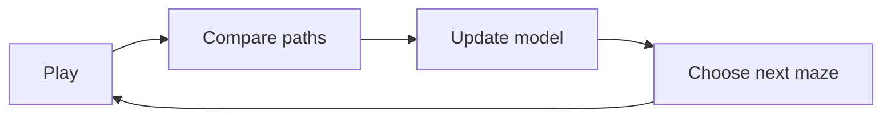

# EvoMaze — Simple Prototype PRD

**Tagline:** A maze that learns how you play.

## 1. Product idea

EvoMaze is a small maze game that updates a player-specific machine-learning model after every completed maze.

After a level, the player sees:

1. The path they took.
2. The shortest possible path.
3. What the model learned from the attempt.
4. How the next maze was selected.

The next maze is not based on a fixed level sequence. It may be harder, easier, or difficult in a different way depending on the model's latest prediction.

## 2. Prototype goal

Build one polished loop that is easy to understand in a short demo:



The prototype succeeds when a player can see that their behavior changed the next maze.

## 3. Target user

- A casual player who wants a short maze game.
- A technical viewer who wants to see real-time ML adaptation visually.
- A social-media viewer who should understand the idea in a 15–30 second demo.

## 4. Core user flow

### Screen 1 — Welcome

- Title: **EvoMaze**
- Message: “Solve a maze. The game will learn how you play.”
- Primary button: **Start**
- Small animated preview of a route changing into a new maze.

### Screen 2 — Play

- Large maze in the center.
- Player moves with arrow keys, WASD, swipe, or on-screen controls.
- Show only three live values: time, moves, and level count.
- Goal is clearly marked.

### Screen 3 — Understand the attempt

After the goal is reached:

1. Replay the player's route in coral.
2. Draw the optimal route in teal.
3. Show a small comparison card:

```text
Your moves       42
Optimal moves    31
Efficiency       74%
Backtracks        3
```

### Screen 4 — Watch the model learn

Show a short, honest update:

```text
Updating your player model

Junction sensitivity   42% → 55%
Dead-end sensitivity   30% → 32%
Long-path sensitivity  38% → 35%

Early signal: junctions slowed you down.
```

Only show values that actually changed in the model. Use **early signal** while confidence is low.

### Screen 5 — Generate the next maze

- Show 20–30 small candidate mazes appearing.
- Fade candidates predicted to be too easy or too hard.
- Highlight the selected maze.
- Explain the selection in one sentence:

```text
Selected for you: more junctions, fewer long corridors.
Predicted challenge fit: 72%
```

- Button: **Try this maze**

## 5. MVP requirements

| ID | Requirement |
|---|---|
| P1 | Generate a valid maze with a reachable goal. |
| P2 | Let the player move with desktop and touch controls. |
| P3 | Record the route, time, moves, wrong turns, and backtracks. |
| P4 | Calculate the shortest path. |
| P5 | Animate the player's path and optimal path. |
| P6 | Update a real online model after every completed maze. |
| P7 | Generate and score multiple candidate mazes. |
| P8 | Select the next maze using the updated model. |
| P9 | Allow the next maze to become easier or harder. |
| P10 | Save model progress in the browser. |
| P11 | Include Skip and Replay controls for the learning animation. |

## 6. UI direction

The UI should be attractive but simple.

- Warm white or light-gray background.
- Navy/slate text.
- Teal for the optimal path and learning state.
- Coral for the player and actual route.
- Soft green for success.
- Rounded cards, light shadows, and generous whitespace.
- The maze remains the main visual; analytics stay secondary.
- Avoid a dark “AI dashboard” appearance.

### Signature motion

Use a thin animated **learning ribbon** that moves from:

```text
completed maze → model card → selected next maze
```

This visually connects the player's behavior to the new level.

## 7. Animation rules

| Stage | Target duration |
|---|---:|
| Goal celebration | 0.4 seconds |
| Player-path replay | 1.0–1.8 seconds |
| Optimal-path reveal | 0.8–1.4 seconds |
| Model update | 1.0–1.5 seconds |
| Candidate selection | 1.0–1.5 seconds |
| Transition to next maze | 0.5 seconds |

- Keep the complete post-level sequence below 7 seconds.
- Show one idea at a time.
- Use named stages instead of a generic loading spinner.
- Support reduced motion.
- Do not show fake training activity while waiting.

## 8. Out of scope

- Accounts or login.
- Backend or cloud database.
- Multiplayer.
- Leaderboards.
- Large neural networks.
- LLM-generated mazes.
- Multiple game modes.
- Production analytics.

## 9. Success criteria

The prototype is complete when:

1. A player can finish several generated mazes.
2. The model changes after every completed maze.
3. The player can compare their route with the optimal route.
4. Candidate mazes are scored with the updated model.
5. A poor attempt can lead to a simpler maze and a strong attempt can lead to a harder maze.
6. The learning sequence is understandable without a technical explanation.
7. The entire loop can be shown clearly in a 15–30 second video.

