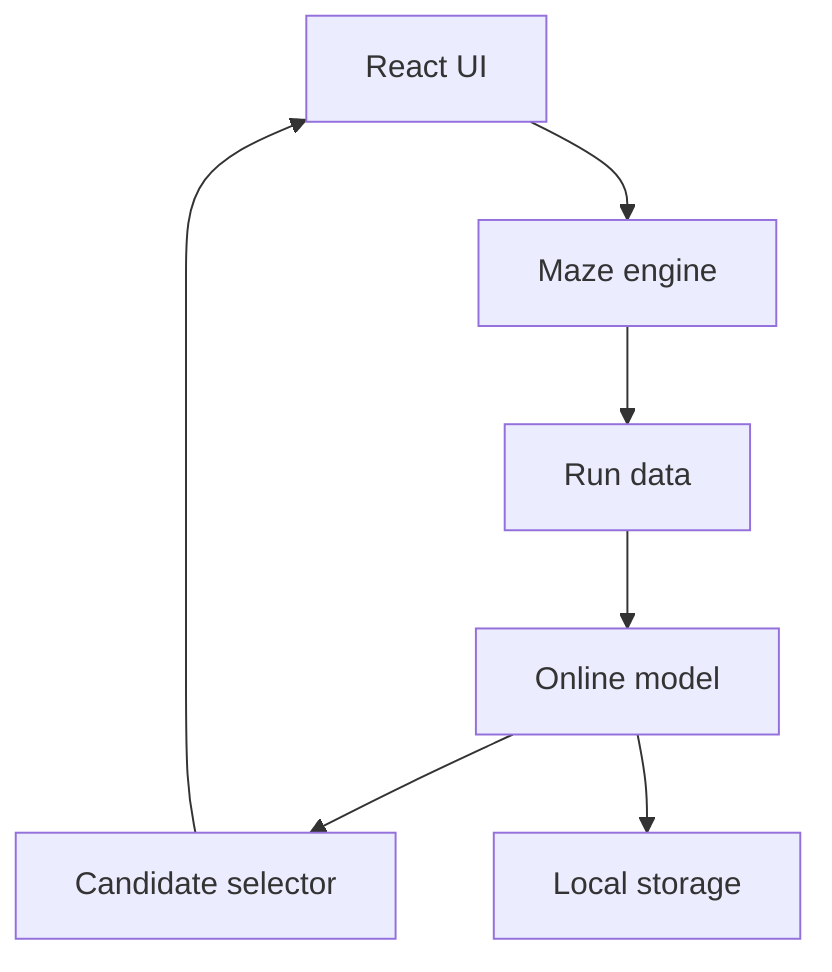

# EvoMaze — Simple Prototype TRD

## 1. Technical goal

Build a browser-based maze game with a small online-learning model. The model learns from one player, updates after every completed maze, and helps select the next maze.

Keep the prototype local, fast, and easy to explain.

## 2. Recommended stack

- React + TypeScript + Vite.
- SVG for the maze and route animations.
- CSS transitions or Framer Motion for screen changes.
- A Web Worker for generating and scoring candidate mazes.
- `localStorage` for progress.
- Vitest for unit tests.
- No backend.

## 3. Simple architecture



The maze generator proposes valid mazes. The ML model does not draw walls directly; it predicts how the player may perform on each proposed maze.

## 4. Maze engine

Use a seeded maze generator such as recursive backtracking. A seed makes each maze repeatable for testing.

Each maze must include:

```ts
type Maze = {
  id: string;
  seed: number;
  rows: number;
  cols: number;
  start: Point;
  goal: Point;
  walls: Wall[];
  features: MazeFeatures;
};
```

Use breadth-first search to verify that the goal is reachable and to calculate the shortest path.

## 5. Data recorded after a maze

```ts
type RunResult = {
  mazeId: string;
  path: Point[];
  moves: number;
  optimalMoves: number;
  timeMs: number;
  wrongTurns: number;
  backtracks: number;
  efficiency: number;
};
```

For the prototype:

```text
efficiency = optimalMoves / actualMoves
```

Clamp the result between `0` and `1`.

## 6. Maze features used by the model

Keep the model small and understandable:

```ts
type MazeFeatures = {
  size: number;
  optimalPathLength: number;
  turnCount: number;
  junctionCount: number;
  deadEndCount: number;
};
```

Normalize every feature to a value between `0` and `1`.

## 7. Online model

Use online linear regression with a sigmoid output. It is small, fast, and its feature weights can be displayed.

Input:

```text
maze features
```

Output:

```text
predicted player efficiency from 0 to 1
```

After the player completes a maze:

```text
prediction = model.predict(mazeFeatures)
actual = optimalMoves / actualMoves
error = actual - prediction
model.learn(mazeFeatures, actual)
```

The update should happen once per completed maze. Save both the old and new model weights so the UI can animate the real change.

### Important rule

Do not implement:

```text
win → difficulty + 5%
loss → difficulty - 5%
```

The next maze must be chosen from the model's predictions.

## 8. Selecting the next maze

After the model updates:

1. Generate 20–30 candidate mazes with different seeds and parameters.
2. Verify that each candidate is solvable.
3. Extract its five maze features.
4. Ask the model to predict player efficiency.
5. Select a candidate close to the target efficiency.

Use this prototype target:

```text
target efficiency = 0.70
```

Selection:

```text
selectedMaze = candidate with the smallest
abs(predictedEfficiency - 0.70)
```

This naturally allows both directions:

- If the player struggled, simpler candidates may be closest to `0.70`.
- If the player performed strongly, harder candidates may be closest to `0.70`.

Reject candidates that are unsolvable, almost identical to the previous maze, or outside the prototype's size limits.

## 9. Cold start

At the beginning, the model has little information.

- Start with neutral weights.
- Use a small, solvable first maze.
- Label the first few updates as **low confidence**.
- Allow candidate mazes to vary by path length, junctions, turns, and dead ends.

The first maze is only a safe starting point. Later selection is model-driven, not a fixed level sequence.

## 10. Animation data

The UI should animate from real calculation results.

```ts
type LearningUpdate = {
  predictionBefore: number;
  actualEfficiency: number;
  weightsBefore: Record<string, number>;
  weightsAfter: Record<string, number>;
  changedFeatures: string[];
  confidence: "low" | "medium" | "high";
};
```

Animation order:

```text
goal reached
→ replay actual route
→ draw optimal route
→ show performance difference
→ animate real weight changes
→ show candidate mazes
→ highlight selected maze
→ expand it into the next level
```

Only start a visual stage when its underlying calculation has completed.

## 11. Main application states

```ts
type GamePhase =
  | "welcome"
  | "playing"
  | "reviewing-path"
  | "updating-model"
  | "selecting-maze"
  | "next-ready";
```

Skipping or replaying an animation must not update the model twice.

## 12. Suggested project structure

```text
src/
├── components/
│   ├── MazeBoard.tsx
│   ├── ResultCard.tsx
│   ├── ModelUpdate.tsx
│   └── CandidateGrid.tsx
├── game/
│   ├── generateMaze.ts
│   ├── solveMaze.ts
│   ├── getFeatures.ts
│   └── analyzeRun.ts
├── ml/
│   ├── onlineModel.ts
│   └── selectCandidate.ts
├── workers/
│   └── maze.worker.ts
├── storage/
│   └── localProgress.ts
├── App.tsx
└── styles.css
```

## 13. Local persistence

Save:

- Model weights.
- Number of completed mazes.
- Recent run results.
- Last maze seed.

Provide a **Reset progress** button with confirmation.

## 14. Error handling

- If candidate generation fails, retry once with safer settings.
- If the model update fails, keep the previous model and do not show a fake learning result.
- If saved data is invalid, reset it and show a short notice.
- If animation is disabled, show the same information as static before/after cards.

## 15. Minimum tests

- Generated mazes always have a path from start to goal.
- The solver returns the shortest path.
- Efficiency is calculated correctly.
- A completed run changes model weights.
- The same model and features produce the same prediction.
- Candidate selection uses model predictions.
- Candidate selection can choose an easier maze after a poor run.
- Skipping animation does not train the model again.
- Progress survives a page refresh.

## 16. Definition of done

The technical prototype is complete when:

1. The game can generate and solve a maze.
2. It records a player's completed route.
3. It compares that route with the shortest route.
4. It updates a real online model.
5. It animates the actual before/after model values.
6. It scores at least 20 valid candidate mazes.
7. It selects the next maze using the updated prediction.
8. The full loop runs smoothly without a backend.

